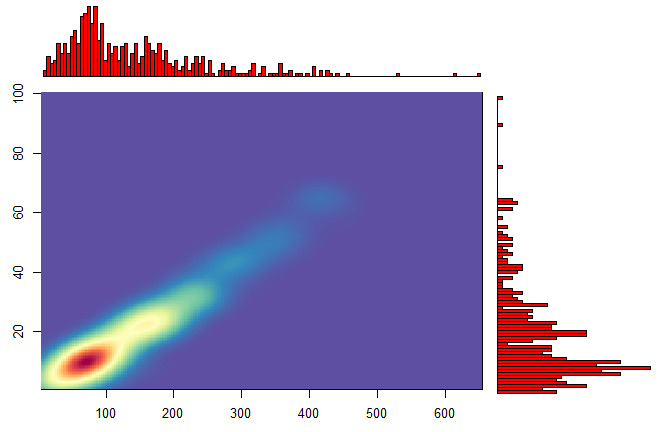

## Spis treœci:
<a href="#0"><h3>0. Podsumowanie</h3></a>
<a href="#1"><h3>1. Biblioteki</h3></a>
<a href="#2"><h3>2. Powtarzalnoœæ wyników</h3></a>
<a href="#3"><h3>3. Wczytanie danych</h3></a>
<a href="#4"><h3>4. Usuwanie wierszy posiadaj¹cych zadane wartoœci</h3></a>
<a href="#5"><h3>5. Pozostawianie unikalnych par wartoœci</h3></a>
<a href="#6"><h3>6. Wartoœci w kolumnach</h3></a>
<a href="#7"><h3>7. Korelacje miêdzy zmiennymi</h3></a>
<a href="#8"><h3>8. LicznoϾ klas</h3></a>
<a href="#9"><h3>9. Rozk³ad liczby atomów i elektronów</h3></a>
<a href="#10"><h3>10. Odtworzemie wykresu</h3></a>
<a href="#11"><h3>11. 10 klas z najwiêksz¹ niezgodnoœci¹ liczby atomów i elektronów</h3></a>
<a href="#12"><h3>12. Rozk³ad wartoœci kolumn</h3></a>
<a href="#13"><h3>13. Sprawdzanie czy na podstawie wartoœci innych kolumn mo¿na przewidzieæ liczbê elektronów i atomów</h3></a>
<a href="#14"><h3>14. Próba stworzenia klasyfikatora przewiduj¹cego wartoœæ atrybutu res_name </h3></a>

<h2 id="0">0. Podsumowanie:</h2>
Celem tego projektu jest analiza danych z Protein Data Bank <a href="http://www.rcsb.org/pdb/home/home.do">PDB</a> przy u¿yciu funkcjonalnoœci jêzyka R. Pocz¹tko dane sk³adaj¹ siê z 795 kolumn i 40309 wierszy. Po odfiltrowaniu niepo¿¹danych danych dane sk³adaj¹ siê z 795 kolumn i 39419 wierszy. Nastêpnie pozostawiamy unikalne pary wartoœci (pdb_code, res_name), ³¹cznie 13894 wierszy. W dalszym punkcie dane zosta³y podsumowane. 


Nastêpnie wykorzystano <a href="http://www.cs.put.poznan.pl/dbrzezinski/teaching/zed/zed_projekt_2015-2016_dane.7z">zbiór treningowy</a>.

<h2 id="1">1. Kod wyliczaj¹cy wykorzystane biblioteki:</h2>
```{r lib, message=FALSE}
library(knitr)
library(tidyr)
library(magrittr)
library(dplyr)
library(ggplot2)
library(ggExtra)
library(corrplot)
library(MASS) 
library(RColorBrewer)
library(reshape2)
library(purrr)
library(caret)
```
<h2 id="2">2. Kod zapewniaj¹cy powtarzalnoœæ wyników przy ka¿dym uruchomieniu raportu na tych samych danych:</h2>
```{r seed}
set.seed(100743)
```

<h2 id="3">3. Kod pozwalaj¹cy wczytaæ dane z pliku:</h2>
```{r data}
data <- read.table("all_summary.txt", 
                    header = TRUE, 
                    sep = ';', 
                    na.strings = c("n/a", "nan", "NA", "NaN"))
```
Kod okreœlaj¹cy liczbê kolumn i wierszy: 
```{r data_cols_rows}
data_columns <- ncol(data)
data_rows <- nrow(data)
```
Otrzymujemy liczbe kolumn: `r data_columns` oraz liczbê wierszy: `r data_rows`.

<h2 id="4">4. Kod usuwaj¹cy z danych wiersze posiadaj¹ce wartoœæ zmiennej res_name równ¹: “DA”,“DC”,“DT”, “DU”, “DG”, “DI”,“UNK”, “UNX”, “UNL”, “PR”, “PD”, “Y1”, “EU”, “N”, “15P”, “UQ”, “PX4” lub “NAN”:</h2>
Tworzymy wektor z niechcianymi wartoœciami:
```{r bad_data}
to_delete <- c("DA","DC","DT", "DU", "DG", "DI","UNK", "UNX", "UNL", "PR", "PD", "Y1", "EU", "N", "15P", "UQ", "PX4","NAN")
```
Filtrujemy dane po kolumnie res_name, filtruj¹c dodatkowo nulle:
```{r clean}
cleaned_data <- filter(data, !is.na(res_name), !res_name %in% to_delete)
```
Po oczyszczeniu danych z niepotrzebnych rekordów otrzymujemy liczbê kolumn: `r ncol(cleaned_data)` oraz liczbê wierszy: `r nrow(cleaned_data)`.
<h2 id="5">5. Kod pozostawiaj¹cy tylko unikatowe pary wartoœci (pdb_code, res_name):</h2>
```{r uniqe_data}
unique_data <- cleaned_data %>% distinct(pdb_code, res_name, .keep_all=TRUE)
```
W wyniku tej operacji pozosta³o nam `r nrow(unique_data)` wierszy. 
<h2 id="6">6. Krótkie podsumowanie wartoœci w ka¿dej kolumnie:</h2>
```{r summary, message=FALSE}
data_summary <- summary(unique_data)
kable(data_summary)
```

<h2 id="7">7. Sekcje sprawdzaj¹c¹ korelacje miêdzy zmiennymi; sekcja ta powinna zawieraæ jak¹œ formê graficznej prezentacji korelacji:</h2>
```{r}
selected_data <- unique_data %>% dplyr::select(dict_atom_non_h_count:dict_atom_S_count)
numeric_data <- na.omit(selected_data)
M <- cor(numeric_data) # get correlations
corrplot(M, method = "circle")
```

<h2 id="8">8. Okreœlenie ile przyk³adów ma ka¿da z klas (res_name):</h2>
Grupujemy dane wed³ug wartoœci w kolumnie res_name:
```{r res_name_group_by}
count_ud <- group_by(unique_data, res_name)
```
Sumujemy iloœæ przyk³adów danej klasy:
```{r res_name_summarize}
summarize_ud <- summarize(count_ud, count = n())
```
Ustalamy kolejnoœæ malej¹co po liczebnoœci:
```{r res_name_arrange}
arrange_ud <- arrange(summarize_ud, desc(count))
```
Otrzymujemy wynik:
```{r res_name_view}
kable(head(arrange_ud, n = 50))
```
<h2 id="9">9. Wykresy rozk³adów liczby atomów (local_res_atom_non_h_count) i elektronów (local_res_atom_non_h_electron_sum):</h2>
Przekszta³cenia dla atomów:
```{r atoms}
d <- dplyr::select(unique_data, local_res_atom_non_h_count)
sg <- group_by(d, local_res_atom_non_h_count)
ds <- summarize(sg, count = n())
da <- arrange(ds, desc(local_res_atom_non_h_count))
kable(ds)
```
Wykresy rozk³adów liczby atomów:
```{r atoms_graph}
ggplot(da, aes(x=local_res_atom_non_h_count, y = count)) + geom_bar(stat="identity", width=1, colour = "red")
```
Przekszta³cenia dla elektronów:
```{r electrons}
d <- dplyr::select(unique_data, local_res_atom_non_h_electron_sum)
sg <- group_by(d, local_res_atom_non_h_electron_sum)
ds <- summarize(sg, count = n())
da <- arrange(ds, desc(local_res_atom_non_h_electron_sum))
kable(ds)
```
Wykresy rozk³adów liczby atomów:
```{r electrons_graph}
ggplot(da, aes(x=local_res_atom_non_h_electron_sum, y = count)) + geom_bar(stat="identity", width=1, colour = "red")
```
<h2 id="10">10. Próbê odtworzenia nastêpuj¹cego wykresu (oœ X - liczba elektronów, oœ y - liczba atomów):</h2>


Pomocny kod do odtworzenia wykresu zosta³ zaczerpniêty z tej <a href=https://www.r-bloggers.com/5-ways-to-do-2d-histograms-in-r/>strony</a>.
```{r trying_to_draw}
h1 <- hist(unique_data$local_res_atom_non_h_electron_sum, breaks = 64, plot = F)
h2 <- hist(unique_data$local_res_atom_non_h_count, breaks = 64, plot = F)
top <- max(h1$counts, h2$counts)
k <- kde2d(unique_data$local_res_atom_non_h_count, unique_data$local_res_atom_non_h_electron_sum, n = 192)

rf <- colorRampPalette(rev(brewer.pal(11,'Spectral')))
r <- rf(32)

oldpar <- par()
par(mar=c(3,3,1,1))
layout(matrix(c(2,0,1,3),2,2,byrow=T),c(3,1), c(1,3))
image(k, col=r) #plot the image
par(mar=c(0,2,1,0))
barplot(h1$counts, axes=F, ylim=c(0, top), space=0, col='red')
par(mar=c(2,0,0.5,1))
barplot(h2$counts, axes=F, xlim=c(0, top), space=0, col='red', horiz=T)
```
<h2 id="11">11. Tabela pokazuj¹ca 10 klas z najwiêksz¹ niezgodnoœci¹ liczby atomów (local_res_atom_non_h_count vs dict_atom_non_h_count) i tabelê pokazuj¹c¹ 10 klas z najwiêksz¹ niezgodnoœci¹ liczby elektronów (local_res_atom_non_h_electron_sum vs dict_atom_non_h_electron_sum;):</h2>
```{r 10_top_classes_a}
n_atom <- dplyr::select(cleaned_data, res_name, local_res_atom_non_h_count, dict_atom_non_h_count)
n_atom <- mutate(n_atom, ld = dict_atom_non_h_count / local_res_atom_non_h_count, dl = local_res_atom_non_h_count / dict_atom_non_h_count)
n_atom <- group_by(n_atom, res_name)
n_atom <- summarize(n_atom, m = mean(ld), niezgodnoϾ = mean(dl))
n_atom <- arrange(n_atom, desc(m))
n_atom <- dplyr::select(n_atom, res_name, niezgodnoϾ)
kable(head(n =10, n_atom), caption = "Tabela pokazuj¹ca 10 klas z najwiêksz¹ niezgodnoœci¹ liczby atomów")
```
```{r 10_top_classes_e}
n_el <- dplyr::select(cleaned_data, res_name, local_res_atom_non_h_electron_sum, dict_atom_non_h_electron_sum)
n_el <- mutate(n_el, ld = local_res_atom_non_h_electron_sum / dict_atom_non_h_electron_sum, dl = dict_atom_non_h_electron_sum / local_res_atom_non_h_electron_sum)
n_el <- group_by(n_el, res_name)
n_el <- summarize(n_el, m = mean(dl), niezgodnoϾ = mean(ld))
n_el <- arrange(n_el, desc(m))
n_el <- dplyr::select(n_el, res_name, niezgodnoϾ)
kable(head(n =10, n_el), caption = "Tabela pokazuj¹ca 10 klas z najwiêksz¹ niezgodnoœci¹ liczby elektronów")
```

<h2 id="12">12. Sekcja pokazuj¹ca rozk³ad wartoœci wszystkich kolumn zaczynaj¹cych siê od part_01 z zaznaczeniem (graficznym i liczbowym) œredniej wartoœci:</h2>
```{r values_cols, warning=FALSE, message=FALSE}
good_cols <- dplyr::select(unique_data, part_01_blob_electron_sum:part_01_density_sqrt_E3)

for (i in 1:ncol(good_cols)) { 
         m <- colMeans(good_cols, na.rm = TRUE)
         plot <- ggplot(data=good_cols, aes(good_cols[i])) + 
                  geom_histogram(bins = 30) +
                  geom_vline(xintercept = m[i], colour="red") + 
                  ggtitle(colnames(good_cols[i])) + 
                  ylab("LicznoϾ") +
                  xlab("WartoϾ")
         print(plot)
}
```
<h2 id="13">13. Sekcja sprawdzaj¹ca czy na podstawie wartoœci innych kolumn mo¿na przewidzieæ liczbê elektronów i atomów oraz z jak¹ dok³adnoœci¹ mo¿na dokonaæ takiej predykcji; trafnoœæ regresji powinna zostaæ oszacowana na podstawie miar R^2 i RMSE:</h2>

Dla atomów:
```{r class_atom, warning=FALSE, message=FALSE}
best_data <- cleaned_data[ , apply(cleaned_data, 2, function(x) !any(is.na(x)))]

names(best_data)

best_data <- dplyr::select(best_data, local_res_atom_non_h_count:local_parts)

inTraining <- createDataPartition(best_data$local_res_atom_non_h_count, p = .75, list = FALSE)
training <- best_data[ inTraining,]
testing  <- best_data[-inTraining,]
fit <- train(local_res_atom_non_h_count ~ . , data = training, method = "lm")
gbmFit1 <- train(local_res_atom_non_h_count ~ ., data = training,
                 method = "lm",
                 verbose = FALSE)
kable(gbmFit1$results)
```

Dla elektronów:
```{r class_el, warning=FALSE, message=FALSE}
best_data <- cleaned_data[ , apply(cleaned_data, 2, function(x) !any(is.na(x)))]

names(best_data)

best_data <- dplyr::select(best_data, local_res_atom_non_h_count:local_parts)

inTraining <- createDataPartition(best_data$local_res_atom_non_h_electron_sum, p = .75, list = FALSE)
training <- best_data[ inTraining,]
testing  <- best_data[-inTraining,]
fit <- train(local_res_atom_non_h_count ~ . , data = training, method = "lm")
gbmFit1 <- train(local_res_atom_non_h_electron_sum ~ ., data = training,
                 method = "lm",
                 verbose = FALSE)
kable(gbmFit1$results)
```

<h2 id="14">14. Sekcjê próbuj¹c¹ stworzyæ klasyfikator przewiduj¹cy wartoœæ atrybutu res_name (w tej sekcji nale¿y wykorzystaæ wiedzê z pozosta³ych punktów oraz wykonaæ dodatkowe czynnoœci, które mog¹ poprawiæ trafnoœæ klasyfikacji); trafnoœæ klasyfikacji powinna zostaæ oszacowana na danych inne ni¿ ucz¹ce za pomoc¹ mechanizmu (stratyfikowanej!) oceny krzy¿owej lub (stratyfikowanego!) zbioru testowego:</h2>

```{r class_res_name, warning=FALSE, message=FALSE}
best_data <- cleaned_data %>% dplyr::select(res_name, local_res_atom_non_h_count:local_parts)
bd2 <- transform(best_data,res_name_id=as.numeric(factor(res_name)))
bd2 <- subset(bd2, select = -c(res_name))

bd2 <- na.omit(bd2)

inTraining <- createDataPartition(bd2$res_name_id, p = .75, list = FALSE)
training <- bd2[ inTraining,]
testing  <- bd2[-inTraining,]
fit <- train(res_name_id ~ . , data = training, method = "lm")
gbmFit1 <- train(local_res_atom_non_h_electron_sum ~ ., data = training,
                 method = "lm",
                 verbose = FALSE)
kable(gbmFit1$results)
```